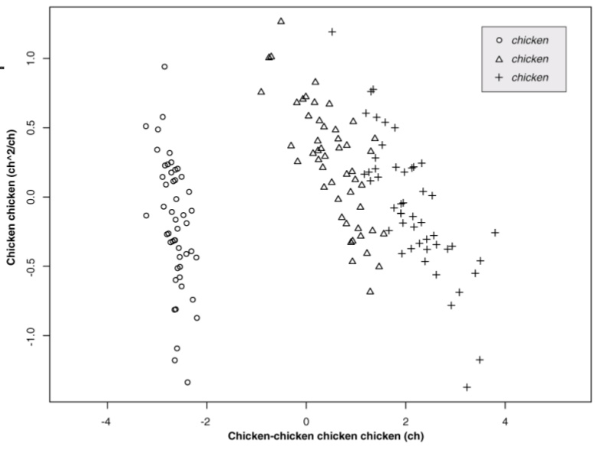

John C. Stansfield^1^ (stansfieldjc@vcu.edu), Shujian Zhang^2^ (szhang42@u.rochester.edu), Ni Zhao^2^ (nzhao10@jhu.edu), Levi Waldron^3,4^ (levi.waldron@sph.cuny.edu), Ekaterina Smirnova^1\*^ (ekaterina.smirnova@vcuhealth.org), Mikhail G. Dozmorov^1\*^ (mikhail.dozmorov@vcuhealth.org)

^1^ Dept. of Biostatistics, Virginia Commonwealth University, Richmond, VA, 23298, USA  
^2^ Dept. of Biostatistics, The Johns Hopkins University, Baltimore, 21205, MD
^3^ Dept. of Biostatistics, Graduate School of Public Health and Health Policy, City University of New York, New York, NY
^4^ Dept. of Biostatistics, Institute for Implementation Science in Population Health, City University of New York, New York, NY

^\*^ To whom correspondence should be addressed: Virginia Commonwealth University, Richmond, VA, 23298, 804-827-2055, mikhail.dozmorov@vcuhealth.org, ekaterina.smirnova@vcuhealth.org

# Abstract

The integrative Human Microbiome project (iHMP), also known as the HMP Phase 2, was designed to investigate the host-microbiome interactions over time. To achieve this goal, it gathered multi-omics data from three studies: 1) MOMS-PI, pregnancy and preterm birth; 2) IBD, gut disease onset, inflammatory bowel disease; and 3) T2D, onset of type 2 diabetes and respiratory viral infection. Multi-omics datasets from 16S rRNA sequencing, cytokine profiling, lipidomics, and basic annotation information, were made publicly available through the iHMP data portal. However, access to these data can be hindered by the complex bioinformatics steps, the different data formats, data dimensions, the need to merge disparate datasets. The `HMP2Data` is an R package providing the iHMP data in a unified framework of standard Bioconductor objects, such as SummarizedExperiment, MultiAssayExperiment, phyloseq, as well as data matrices. It enables a bioinformatician to quickly access and analyze the iHMP data within the R/Bioconductor ecosystem.

### Keywords

# Introduction

The development of metagenomics is fueled by the falling costs of sequencing. Owning to the fact that microbial genomes are much smaller than vertebrate genomes, relatively small amount of sequencing (and costs) provides an affordable way to generate rich and useful sequencing. Consequently, several consortia generated and made available unique datasets illuminating the microbial diversity of life [@McDonald:2018aa; @Thompson:2017aa]. 

The integrative Human Microbiome Project was designed to learn host-microbiome interactions over time [@Integrative-HMP-iHMP-Research-Network-Consortium:2014aa]. Three longitudinal studies were conducted, each gathering multi-omics from patients over several visits. The Multi-Omics Microbiome Study: Pregnancy Initiative (MOMS-PI) was designed to study the association between dynamic changes in the vaginal microbiome and host-specific measures and the adverse pregnancy outcomes, such as preterm delivery. The Irritable Bowel Disease multi-omics database (IBDMBD) was developed to evaluate the dynamisc of gut microbial ecosystem as a target for diagnosis. The type 2 diabetes mellitus (T2D) study was set to perform a detailed analysis of the biological processes that occur in the human microbiome and host by longitudinal profiling of patients at risk.

One of the most important aspects of open science is data availability, allowing data reanalysis and investigation of questions not envisioned in the original studies. For microbiome studies, the raw sequencing data and processed operational taxonomic units (OTU) tables are frequently available from public repositories such as Gene Expression Omnibus (GEO) and Short Read Archive (SRA). Databases containing processed data from multiple studies, such as MicrobiomeHD [@Duvallet:2017aa], Qiita [@Gonzalez:2018aa], are also being created. The Human Microbiome Project Data Portal (https://portal.hmpdacc.org/) was set to streamline data access to Phase 1 and Phase 2 HMP data.

Although the data availability is essential, methods for its analysis are no less important. Various software solutions have been implemented to access specific datasets, such as Jupyter notebooks for the analysis of the American Gut project [@McDonald:2018aa], as well as web-based platforms, such as Qiita [@Gonzalez:2018aa]. Although the R/Bioconductor ecosystem is a de facto standard in genomics research [@Gentleman:2004aa], R-based methods to access microbiome data still lag behind. The `curatedMetagenomicData` R package provided microbial taxonomic, functional, and gene marker data for samples collected from different body sites [@Pasolli:2017aa]. The `HMP16Sdata` R package was developed to provide Phase 1 HMP data [@Schiffer:2019aa]. However, the streamlined access to Phase 2 HMP data within R/Bioconductor ecosystem does not exist.

The ability to integrate multiple layers of omics data is another enticing possibility envisioned by the iHMP consortium. Several complementary datasets from the same subjects were expected to be generated. Consequently, methods for integrative analysis of microbiome omics data have been developed, reviewed in .

The iHMP data was generated by sequencing of the 16S rRNA gene, a common taxonomic marker for bacteria and archaea [@Olsen:1986aa].

# Methods

The data in BIOM format [@Buttigieg:2016aa] were downloaded from ...

Greengenes v.13.5 database contaiting taxonomy annotations at 7 levels was used to annotate IDs in the 'biom' files (`gg_13_5_taxonomy.txt.gz`, downloaded at 01/25/2019). 

# Results

How to insert single [@Dozmorov:2016aa][@Glass:2016aa] or multiple references [@Dozmorov:2016aa; @Glass:2016aa].

+-------+
|       |
| **Figure 1. How to insert a figure.** Chicken chicken chicken.     |
+-------+

# Discussion

- Data is not perfect - lots has been promised, limited delivery. Limitations of integrative analysis.

- OTUs are not perfect, describe other binning metrics
Sequence analysis and taxonomic profiling of iHMP data were done by assigning sequences to operational taxonomic units (OTUs) clustered by sequence similarity to existing rRNA databases [@Caporaso:2011aa]. While this approach is considered useful, many reads could not be mapped to existing rRNA databases [@Thompson:2017aa], leading to loss of information. Reference-free methods, such as Deblur [@Amir2017], and pipelines (DADA2 [@Callahan:2016aa]), have been developed providing sequencing error-corrected single-nucleotide resolution amplicon sequence variants (ASVs). Summarizing the 16S data as ASV tables provides finer resolution of the data; consequently, we expect the next phase of the iHMP project to include the data (re)processed at the ASV level.

RSV

- Greengenes are not updated. RDP, SILVA? NCBI RefSeq 16S rrna database, Genome Taxonomy Database (GTDB)
Although the Greengenes taxonomy reference database remains a gold-standard in microbiome research [@McDonald:2012aa], it has not been updated since 2013. The use of more recent databases, such as SILVA [@Quast:2013aa], is warranted for maximally accurate reconstruction of mocrobial taxonomy.

- Pipelines differ, need to unify data processing (bioBakery?)
Virtually any large-scale consortium developed their own data processing and analysis pipelines [@Thompson:2017aa].

- Analysis
We described a limited set of analyses that can be performed using the `HMP2Data` R package. However, many more analyses are possible (see `phyloseq` tutorials [@McMurdie:2013aa], a detailed microbiome analysis workflow [@Callahan:2016ab]). As the new statistical methods continue to be developed, we envision our package will continue providing novel insights in the role of human microbiome in health and disease.

# Abbreviations

# Acknowledgements

_Conflict of Interest._ None.

# Funding

# References
